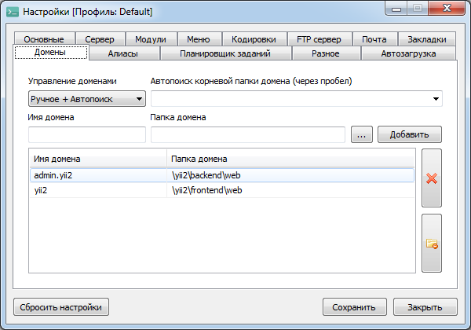

# Развертывание проекта на примере OpenServer

1. Зайти в директорию проектов OpenServer

2. Открыть окно команд и выполнить:

    <code>
	git clone https://github.com/DmitryMaksimov/yii2
    </code>
	
    Появится папка yii2

3. Скофигурировать OpenServer

    

    

4. Зайти в папку проекта

5. Проинициализировать Yii командой

    <code>composer update</code>

6. Инициализировать проект

    <code>init</code>

    Выбрав продакшн или девелопмент режим (со всем соглашаться)

7. Настроить параметры базы данных в файле /common/config/main-local.php

    > Для OpenServer надо поставить пароль root и прописать имя предварительно созданной БД и не забыть сохранить

8. Выполнить миграцию

    <code>yii migrate</code>

9. Выполнить миграцию Rbac

    <code>yii migrate --migrationPath=@yii/rbac/migrations/</code>

10. Зайти на сайт <a href='yii2/index.php?r=site%2Fsignup'>yii2/</a> и создать пользователя (пользователь с id = 1 будет администратором)

11. Проверить почту в папке /frontend/rutime/mail/

    <warning>Открыть письмо в браузере и пройти по ссылке</warning>

12. Выполнить инициализацию Rbac

    <code>yii rbac/init</code>

На этом инициализация проекта окончена! Всего-то 12 пунктов )

# Тестирование:

## Главная страница

- Создайте один или несколько постов нажав на кнопку в верхнем меню "Add post".
- Попробуйте редактировать/удалять вновь созданный пост прямо в теле, закголовок New title, тело пустое (его надо нащупать).

Примечание: на главной странице имеется пагинация на 20 записей

## Url генератор

Генератор доступен через соответствующее меню

- Можно делать цикличные ссылки
- Можно пробовать создавать одну и ту же ссылку несколько раз, пересоздаваться не будет, выдаст уже сохраненную

## Список дел

Ващпе простой функционал. Сначала была создана standalone страница, но потом решил прикрутить сюда.
Планировал сделать hta приложение, но там LocalStorage то не работает :-(

## Админская панель

<a href='http://admin.yii2/'>admin.yii2</a>
- Тут я добавил вычисляемую колонку с доступными ролями для пользователей.
- Из правил только: 
    1. admin не может удалить админа (но в системе нет функционала назначения админов, хотя можно :], зато может поменять ему пароль гыыыы )
    2. Не кушать желтый снег.
- При редактировании пользователя, можно задать ему пароль, если заполнить поле password
- При создании пользователя задавать пароль не обязательно, но тогда юзер shell not pass

Из проделанной работы мне не понравился получившаяся портянка в /frontend/views/site/index.php
Там и скрипты используемые только в этой модели, там и генерации видов. Можно было разбить на site.js и render('post'), но пока не стал.
